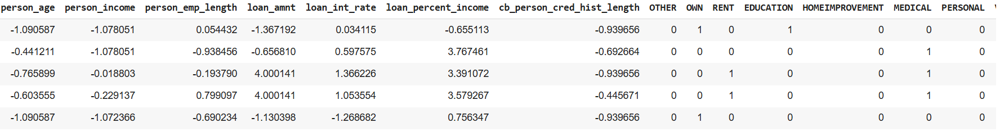
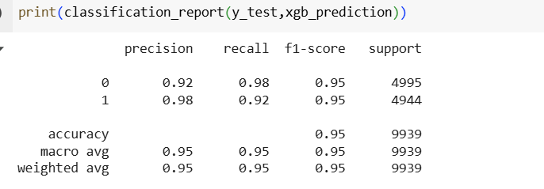

# Credit Risk Probability of Default (PD) Model

This project is a comprehensive end-to-end machine learning pipeline for predicting the probability of default (PD) on credit risk data. The workflow includes data preprocessing, feature engineering, model training, evaluation, and exporting results.

## Features
- Data cleaning and preprocessing
- Feature engineering and categorical variable treatment
- Data balancing using SMOTE
- Model training with Logistic Regression, Random Forest, and XGBoost
- Model evaluation using classification metrics
- Feature importance extraction
- Model serialization (saving trained models)
- Exporting predictions to Excel

## Technologies Used
- Python (Pandas, NumPy, Seaborn, Matplotlib)
- Scikit-learn
- imbalanced-learn (SMOTE)
- XGBoost

## How to Run
1. Clone the repository and open the notebook `Credit_Risk_PD_Model.ipynb` in Jupyter or VS Code.
2. Ensure the required libraries are installed:
   - pandas
   - numpy
   - seaborn
   - matplotlib
   - scikit-learn
   - imbalanced-learn
   - xgboost
3. Place the dataset (`credit_risk_dataset.csv`) in the specified path or update the path in the notebook.
4. Run the notebook cells sequentially to preprocess data, train models, and generate predictions.

## Outputs
- Trained model files: `logisticPDmodel.pkl`, `RandomForesPDmodel.pkl`, `XGBpdModel.pkl`
- Predictions exported to Excel: `pd_prediction.xlsx`
- 

## Project Structure
- `Credit_Risk_PD_Model.ipynb` – Main notebook with all code and analysis
- `README.md` – Project overview and instructions

## Author
- [Nayan Dubey]

